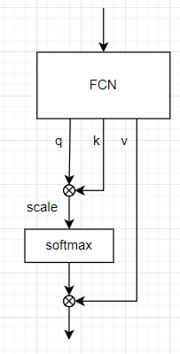
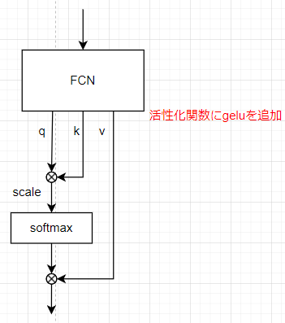
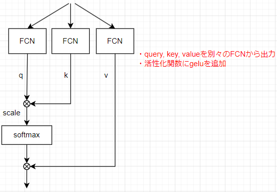
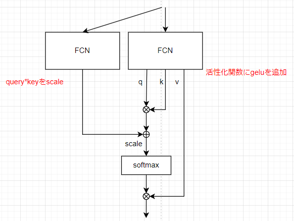
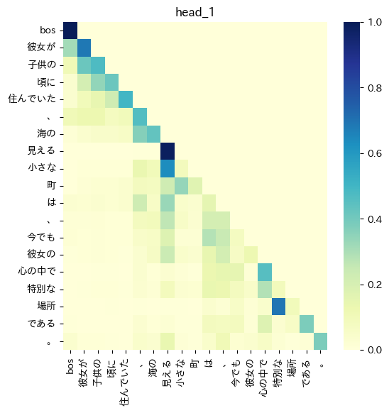
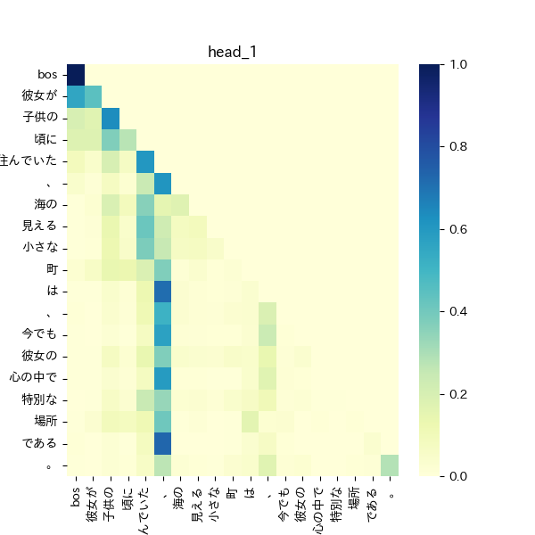
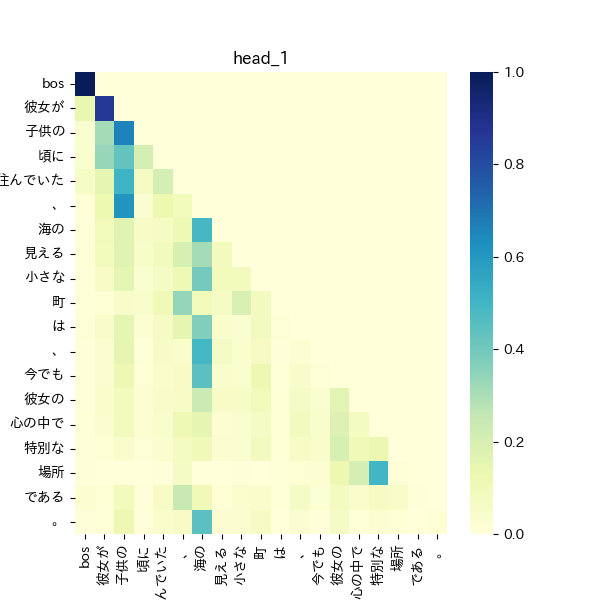
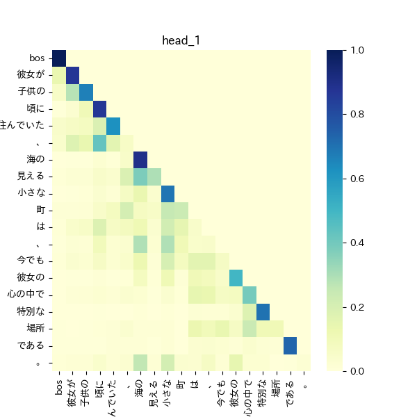

できるだけ小さいサイズのモデルで日本語を喋れるモデルを作りたい、ということでllama2のpre_trainingはすでにおこなったがさらなる改善のため、いくつかのアーキテクチャを考えてみる。  
比較のベースとなる標準的なモデルに対し、新たに3つのモデルを作成し比較する

transformerのattention部分に対して修正や変更を加えたものはEfficient Transformerと呼ばれる。attentionの計算では、keyとvalueの行列積の計算のコストが高く、この部分を近似や次元削減を行い、計算効率やメモリ効率の向上を目指したものがいくつか提案されてる。Linformerでは近似により、ReformerではLSHというアルゴリズムによりattentionの計算を行っている。

Linformer  
https://arxiv.org/abs/2006.04768

Reformer  
https://arxiv.org/abs/2001.04451


## モデル
ベースのモデルに対し少しづつ複雑さを増したモデルを作成する

#### ベースのモデル
head数1、layer数10のモデルをベースモデルとする。
attentionの部分を簡単に表すと以下のようになる。attentionへの入力は全結合層を通り、queryとkey, valueに分割される。queryとkeyの積を取りscaleした後softmaxを取ったものとvalueの積を取る。(実際にはhead数の次元やgrouped queryが含まれるが省略)



ベースのモデルに対していくつかの修正を行う  
いずれのモデルもhead数やlayer数はベースモデルと同じ

#### モデル1(非線形活性化関数+bias)
query, key, valueを出力するFCNに対して、biasと活性化関数geluを追加する。



#### モデル2(query, key, valueを別々の全結合層で生成)
query, key, valueは一つの全結合層の出力を分割して作られていたが、これを別々の層で計算させる。  
queryとkeyで異なる特徴を捉えてほしい期待



#### モデル3(query*keyにscaleを追加)
通常のattention weightでは、queryとkeyの積をsoftmaxを取り、valueとの積を取る。  
queryとkeyの積に対して、別のFCNを追加しその出力を足し合わせて、softmax、valueとの積を取るようにする。  
これは、queryに対応するkeyを取り出す処理に対し、attentionへの入力を使いquery,key以外の別の視点でscaleを行ってほしいという期待  




## 実装
参考にするコード
https://github.com/Lightning-AI/lit-gpt

attention部分はここ

https://github.com/Lightning-AI/lit-gpt/blob/main/lit_gpt/model.py#L169

attentionへの入力は線形結合を通った後、query, key, valueに分割される。

query, key, valueに対し、head数に対する次元操作や、grouped queryの操作を行った後、attentionを計算している。  
attentionの実装はtorchのものを使用している。

https://pytorch.org/docs/stable/generated/torch.nn.functional.scaled_dot_product_attention.html

queryとkeyの積を計算し、maskを適応、softmaxを取り、attention_weightを算出している。

```
attn_weight = query @ key.transpose(-2, -1) * scale_factor
attn_weight += attn_bias
attn_weight = torch.softmax(attn_weight, dim=-1)
...
return attn_weight @ value
```

このあたりを修正する

## 学習
100Mのモデルに対し、1Bの日本語と英語のデータセットで2epoch学習行う

モデル1とモデル2は100Mのサイズ、モデル3のみ追加の層があるので120M

学習はPaperspace Gradientを使う  
https://www.paperspace.com/

## lossと学習時間の結果
### lossとval lossの比較
2epoch学習させた最終的なlossとval lossを表にまとめる
| model | loss | val loss|
| ---- | ---- | ---- |
|ベースモデル | 4.0861 | 4.8150 |
|非線形活性化関数+bias | 4.2262 | 4.6753 |
|query, key, valueの生成を分ける |  4.8802 | 4.7191 | 
|query*keyにscaleを追加 | 4.9979 | 4.7278 |

ベースモデルについて、他のモデルと比べlossは一番低いが、val lossは高くなっており、過学習の可能性がある。  
val lossについては、`非線形活性化関数+bias`が一番低く、`query, key, valueの生成を分ける`と`query*keyにscaleを追加 `は近い値となった。  

今回のモデルサイズとデータセット的にベースモデルより少し**複雑なモデルのほうが適していそう**  
ただし、`query, key, valueの生成を分ける`や`query*keyにscaleを追加`ほどの複雑さは不要かもしれない

### 学習にかかった時間

| model | 学習にかかった時間 (h) |
| ---- | ---- |
| ベースモデル | 13.6 |
| 非線形活性化関数+bias | 13.3 |
| query, key, valueの生成を分ける |  12.2 |
| query*keyにscaleを追加 | 14.6 |


ベースモデルと`非線形活性化関数+bias`は同じくらいの学習時間であり、非線形の計算やbiasは大きなコストではないことがわかる。  
`query, key, valueの生成を分ける`はベースモデルより学習時間は短くなっている。これは、**query, key, valueの計算が効率的に行われた可能性**がある。  
`query*keyにscaleを追加`ではparameterが増えている分、より多くの時間が必要となったと考えられる。  

まとめると、複雑過ぎるモデルでは学習時間が長くなりlossやval lossにおいても良い結果とはならなかった。
一方で、`非線形活性化関数+bias`や`query, key, valueの生成を分ける`ではlossや学習時間の面でベースモデルよりよい結果となった。
**ある程度の複雑性は必要**だが、そのバランスは注意する必要がある。


## 生成された文章での比較
「彼女が子供の頃に住んでいた、海の見える小さな町は、」を与えて続く文章を生成する。

#### ベースモデル
彼女が子供の頃に住んでいた、海の見える小さな町は、その町と隣接し、町は、町が広がる場所にある。

#### 非線形活性化+bias
彼女が子供の頃に住んでいた、海の見える小さな町は、その街の風景を描いた。そしてこの村には「おとな」という名前が残っている

#### query, key, valueの生成を分ける
彼女が子供の頃に住んでいた、海の見える小さな町は、この村には「山」と呼ばれている。また北部に位置する島として知られる

#### query*keyにscaleを追加
彼女が子供の頃に住んでいた、海の見える小さな町は、その地形が広がる。この山には「水」の由来がある。

### 所感
ベースモデルでは、「町」の繰り返しが発生している。`非線形活性化+bias`では「おとな」などの追加情報が含まれるようになっている。
`query, key, valueの生成を分ける`や`query*keyにscaleを追加`では「山」や「水」に加え、地形の要素など文脈を考慮や具体的な追加情報が含まれている。


ベースモデルではシンプルな文章が生成されたのに対し、`query, key, valueの生成を分ける`や`query*keyにscaleを追加`では**創造的なものや文脈を考慮するような文章**が生成されている。

## 短い文章の場合
「彼女が」を与えて続く文章を生成する。

#### 非線形活性化+bias
彼女が、1990年代後半から2000年に

#### query, key, valueの生成を分ける
彼女が、「」と言われた。 ...

#### query*keyにscaleを追加
彼女が

### 所感
短い文章からの予測はいずれのモデルもうまく生成できていない。  


## 形容詞に続く予想
「彼女が子供の頃に住んでいた、海の見える小さな」に続く文章を生成させる  
ここでは形容詞「小さな」に続く名詞を期待。  

#### 非線形活性化+bias

```
p:0.33, 町
p:0.23, 街
p:0.19, お
p:0.16, 村
p:0.10, 温泉
```

#### query, key, valueの生成を分ける

```
p:0.24, 場所
p:0.21, 花
p:0.19, 地
p:0.18, 山
p:0.17, 緑
```

#### query*keyにscaleを追加

```
p:0.21, 島
p:0.20, 場所
p:0.16, 山
p:0.14, 町
p:0.14, 地
```

### 所感
いずれのモデルも形容詞に対して、名詞を予想できている。  

## 動詞が期待される文章
「海の見える小さな町で彼女は、静かに」に続く文章を生成  
「過ごす」や「暮らす」などの動詞を期待。

#### 非線形活性化+bias
```
p:0.26, 過ご
p:0.23, 暮ら
p:0.20, 眠
p:0.18, 寝
p:0.12, お
```

#### query, key, valueの生成を分ける
```
p:0.35, な
p:0.27, して
p:0.15, なって
p:0.12, 感じ
p:0.11, 「
```

#### query*keyにscaleを追加
```
p:0.24, した
p:0.23, 過ご
p:0.21, 歩いて
p:0.16, 歩き
p:0.16, 立ち
```

### 所感
どのモデルも特定の1つの単語の確率が高いわけではなく、次の単語に迷っている感じ  
`query, key, valueの生成を分ける`モデルでは、「して」、「なって」などの機能動詞が選択肢として現れている。


## 主語に続く文章
「海の見える小さな町で、彼女は」に続く文章を予測

#### 非線形活性化+bias
海の見える小さな町で、彼女は「アクション」と題した。

#### query, key, valueの生成を分ける
海の見える小さな町で、彼女は「お悩みやご相談をさせていただきます

#### query*keyにscaleを追加
海の見える小さな町で、彼女は「お友達に会いしていいのかな

### 所感
いずれのモデルもあまり意味のある文章は生成されていない。どのモデルでも事前の文脈があまり考慮されず、直前の「彼女は」の影響で会話文の「が生成されている。

## 主語に続く文章2
「海の見える小さな町で彼女は、」に続く文章を予測  

#### 非線形活性化+bias
海の見える小さな町で彼女は、「アクション」と題した写真を

#### query, key, valueの生成を分ける
海の見える小さな町で彼女は、「おしゃれの」と言われることから

#### query*keyにscaleを追加
海の見える小さな町で彼女は、その場所に乗る。そしてこの建物の

### 所感
`非線形活性化+bias`と`query, key, valueの生成を分ける`では「主語に続く文章」と同様に会話文が生成されている。
一方で`query*keyにscaleを追加`では、文脈を考慮したような「その場所」が生成されている。

「、」句点に対する注意がそれぞれのモデルで異なり、`query*keyにscaleを追加`ではより文脈を考慮できている可能性がある。


## ヒートマップ
### ベースモデル
縦軸がquery、横軸がkeyを表す。値が大きいほど青色が強く表される。

右上の三角形の値が0となっており、これはcausal modelとして先の単語を使って予測しないようなmaskが適応されていることを表す。query「彼女が」に対して、key「彼女が」では高い値となっており、これは自己注意が行われていることを表す。自己注意の高さは文章中でその単語が重要であることを表している。

ベースモデルのヒートマップをみると、文章の前半(queryの前半)部分で自己注意が高くなっている。ただし、中盤では値は小さくなっており文全体は捉えきれてない可能性がある。



### 非線形活性化+bias
文章の前半部分で自己注意が高くなっており、後半は値は小さくなっている。また、いずれのqueryに対してもkey「、」が高い値となっており、  
前半部分が重要な部分であると捉えている可能性がある。




### query, key, valueの生成を分ける
自己注意は全体的に少ないが「彼女が」「子供の」、「海の」などいくつかの単語は捉えている。  
多くのqueryで、key「子供の」やkey「海の」が値が高くなっており、この文章において重要な単語として捉えている可能性がある。




#### query*keyにscaleを追加
全体的に値が高く、自己注意も全体にわたり、文章全体を捉えようとしている可能性がある。  
また「彼女が」や「海の」などのいくつかの単語に対しては自己注意が高くなっており、文脈において重要な単語についても関心を示している。  



まとめると、`非線形活性化+bias`では文章の前半部分に強く注意を行い、`query, key, valueの生成を分ける`では特定の単語に高い注意を行っている。  
`query*keyにscaleを追加`では全体的な文章や特定の単語への注意を行っており、文章の意味理解としては優秀かもしれない


## まとめと所感
`非線形活性化関数+bias`はモデルの複雑性は他のモデルと比べ低いものの、ベースモデルに比べ単純な変更で一般化性能を向上させた。文章中の重要な単語への注意は行えていたものの、文脈を考慮した文章の生成などは難しかった。

`query, key, valueの生成を分けるモデル`では、**文章に対して広範囲に注意**を向けており、**重要な単語の抽出**も行えていた。

`query*keyにscaleを追加するモデル`では文脈を捉え、重要な単語へ注意を向けており、その他のモデルに比べ**優秀な文章理解**が行えていた。一方で、学習時間が増え、lossやval lossは低い値とならなかったため、さらなる調整が必要である。

シンプルなモデルでは、文脈理解が難しかったものの、複雑にしたモデルでは文章全体や単語に対する注意など注意の幅は広がっていた。一方で複雑過ぎるモデルでは、学習時間の増加やlossやval lossは大きくなっており複雑性のバランスは必要である。

小さいモデルを前提とすると学習時間の増加はあまり大きな問題ではなく、`query, key, valueの生成を分けるモデル`や`query*keyにscaleを追加するモデル`のバランスを調整して更に比較を行ってみたい