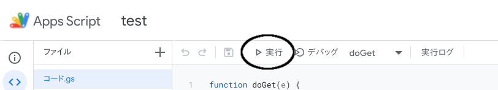
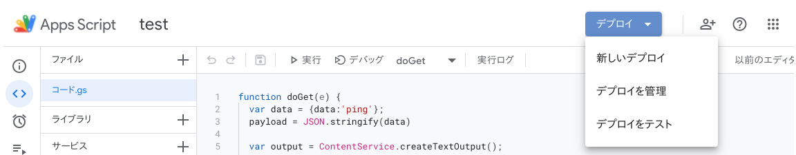

翻訳用のAPIを簡単に利用したいことあると思います。  
Google TranslateはAPIを公開してますが、気軽に使う場合には少し不便です。  
そういう場合は、Google Apps ScriptからGoogle Translateの機能を使うと便利です。

## 結論
```
LanguageApp.translate(value, "en", "ja");
```


## プロジェクトの作成
以下のURLにアクセスするか、Google Driveから新規＞その他＞Google Apps Scriptを選択することで作成できます。

https://script.google.com/


## 最初のコード

https://developers.google.com/apps-script/guides/web

doGetという関数を作ります。
これでGET requestが来たときにこの関数が走ります。


```javascript
function doGet(e) {
  Logger.log("hello!")
}
```

実行ボタンから、実行します。



実際にrequestが来たときに、jsonを返せるように関数を追加します。

```javascript
function doGet(e) {
  Logger.log("hello!")
  return responseJson('ping')
}


function responseJson(data) {
  const d = {'data': data}
  payload = JSON.stringify(d)

  var output = ContentService.createTextOutput();
  output.setMimeType(ContentService.MimeType.JSON);
  output.setContent(payload);
  return output;
}
```


左上の新しいデプロイから、デプロイします。



デプロイが完了すると、URLが生成されるので、リクエストを送ります。  
curlの場合、リダイレクトを許可するようにオプション`-L`が必要です。  

```
$ curl -L -X GET https://script.google.com/macros/s/aaaaaaaaaaaaaaaaaa/exec
{"data":"ping"}
```

指定したbodyが返ってきているのが確認できます。

## Google Translateを使う

使い方はシンプルで、以下の関数を呼び出すだけです。

```
LanguageApp.translate(value, "en", "ja");
```

**Parameters**

| Name  |  Type |  Description |
| - | - | - |
|text | String|the text to translate
|sourceLanguage | String | the language code in which text is written. If it is set to the empty string, the source language code will be auto-detected
|targetLanguage|String|the language code to which the text should be translated

**Return**

String — the translated text

https://developers.google.com/apps-script/reference/language/language-app?hl=ja

## GASからGoogle Translateを使う

Post requestがあったときに、動作するようにdoPostを追加します。
`JSON.parse`でrequest bodyをパースします。

```javascript
function doPost(e) {
  if (!e || !e.postData) {
    return responseJson('not set request body')
  }
}
```

翻訳部分を追加します。

今回のbodyは、`{"title": "title", "summary":"I am running" }`のような想定です。


```javascript
function doPost(e) {
  if (!e || !e.postData) {
    return responseJson('not set request body')
  }
  const params = JSON.parse(e.postData.getDataAsString());
  if (params.title && params.summary) {
      const title = t(params.title)
      const summary = t(params.summary)
      return responseJson({title_en: title, summary_en: summary});
  } else {
      return responseJson('not set title or summary')
  }
}

function t(value){
  return LanguageApp.translate(value, "en", "ja");
}
```

リクエストを投げる

```
curl -L -X POST -H "Content-Type: application/json" -d '{"title":"title", "summary":"I am running"}' https://script.google.com/macros/s/aaaaaaaaaa/exec
```

